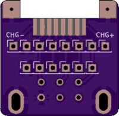
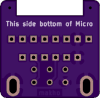

# OXY-Dongler
Dongle to allow Game Boy Advance peripherals to be used on a Game Boy Micro

You can order the PCB files from Oshpark by using my shared projects link for the [solid board](https://oshpark.com/projects/G7eothoV) or the [breakaway board](https://oshpark.com/shared_projects/KbXcIG3Z) or you can upload the gerber zip archives in the [gerbers directory](https://github.com/makhowastaken/OXY-Dongler/tree/master/gerbers) to any of your choice of PCB fabricator. Oshpark will probably be the cheapest for small QTYs (3 for $1.40). 

There are two versions, one is a solid board similar to [BlindEye's version](https://www.tindie.com/products/hidarite/link-cable-adapter-for-game-boy-micro/) but with a few small changes implemented that should make the board easier to assemble and stronger. I also added a pinout for the charge pins on the Micro EXP connector but they are not connected to the AGB EXP connector. My boards are slightly bigger than BlindEye's and do not have the mounting holes for the 3D printed case and such will not be compatible. I will likely revise these boards after testing them. 

The other version of the board is identical except that it has several holes drilled down the middle to allow the PCB to be separated into two halves. You'd then need to connect the two halves with six separate conductors. I haven't found a good off-the-shelf part for this but a small section of ribbon cable should work fine. 

Both ports need to be soldered on the same side of the board. I added another set of contacts to the breakaway version so that the port may be soldered in the middle of the board instead of on top, but the orientation of the port itself has not changed. 

To assemble this, you'll need two parts plus these PCBs.
1. A cheap USB charging cable for the Micro: https://www.aliexpress.com/item/33024882598.html
2. A bare AGB/AGS EXT port: https://www.aliexpress.com/item/32815359689.html

And to assemble, see this video I made: https://youtu.be/QlkQgUIXweQ

The video is of BlindEye's PCBs but the assembly and function will be identical. 
